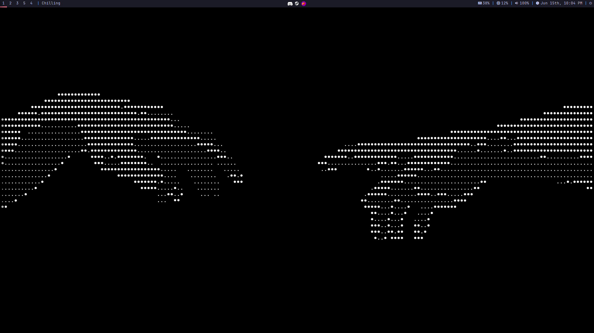
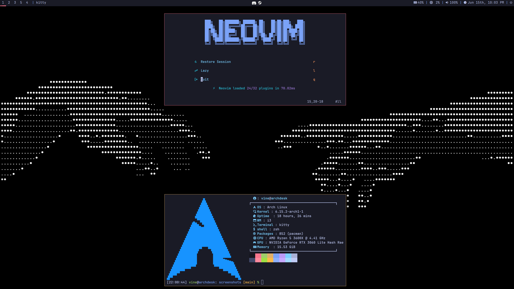
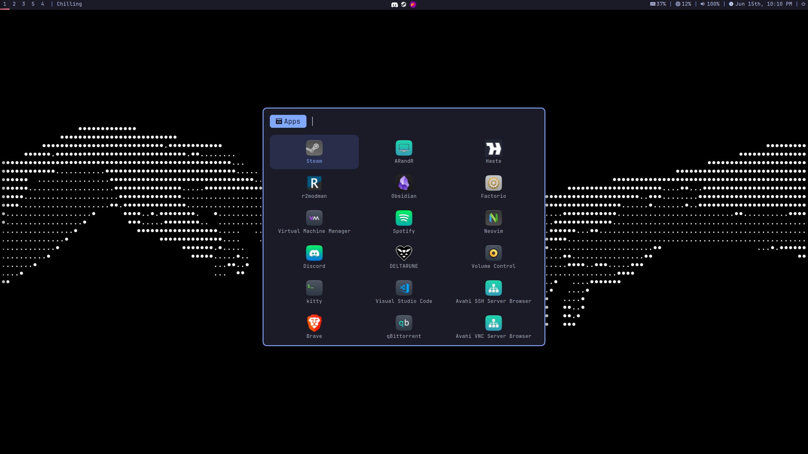
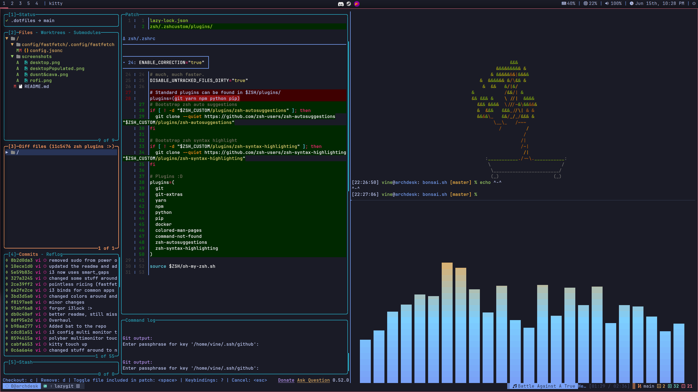

# .dotfiles

My personal dotfiles for my Arch Linux setup!

You'll quickly notice I gravitate toward the [Tokyo Night](https://github.com/folke/tokyonight.nvim) colorscheme, if that’s your vibe too, you might enjoy this setup!

## Packages

Some of the most notable packages included in this setup:

- i3-wm `(tiling window manager)`
- feh `(used to set wallpapers)`
- picom `(X compositor)`
- polybar `(top bar)`
- rofi `(app launcher)`
- thunar `(file manager)`
- kitty `(terminal emulator)`
- tmux `(terminal multiplexer)`
- zsh + [Oh My Zsh](https://ohmyz.sh/) `(shell and framework)`
- neovim `(text editor)`
- dunst `(notification daemon)`

> there is a complete list of the packages in `/scripts/install_setup.sh`, inside the variables `pacman_packages`, `yay_packages` and `extras`.

## Screenshots









## Installation

The script below fetches `setup.sh`, which configures the environment using helper scripts in `/scripts`.

> ⚠️ This script is meant to be run on a fresh Arch Linux installation. If you're on an existing setup, be sure to back up your configs before running it.

> **Requirements**: `curl` and `bash` must be installed.

```bash
bash -c "$(curl -fsSL https://raw.githubusercontent.com/vinegm/.dotfiles/master/setup.sh)"
```

> Note: This setup is tailored for my hardware, so there may be quirks or issues on other machines. Feel free to reach out if you need help!