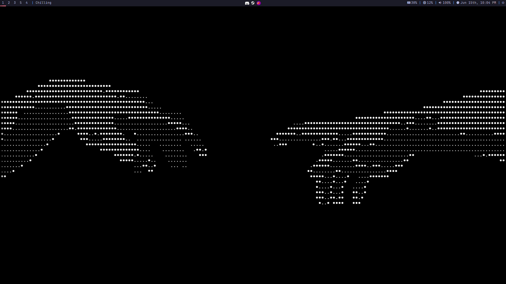
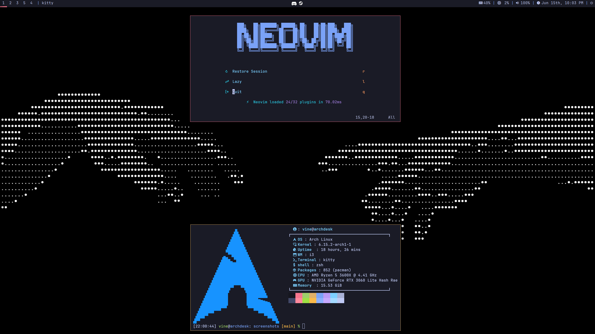
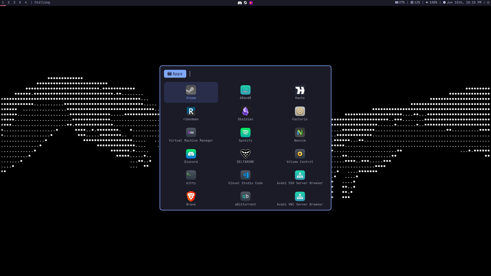
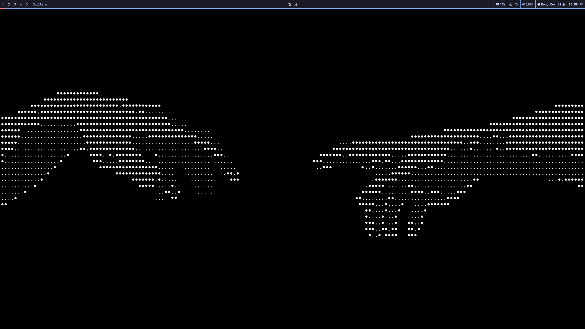
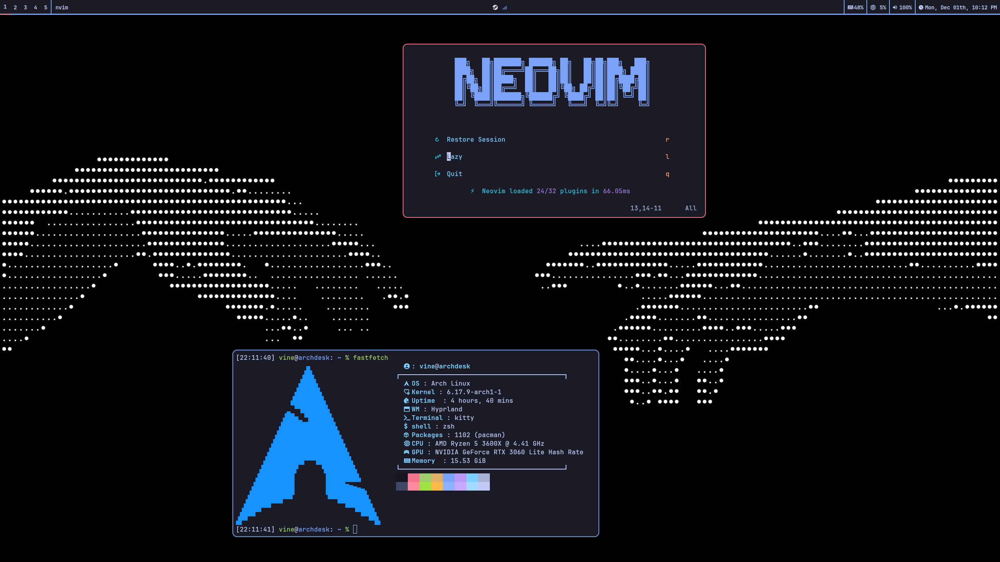
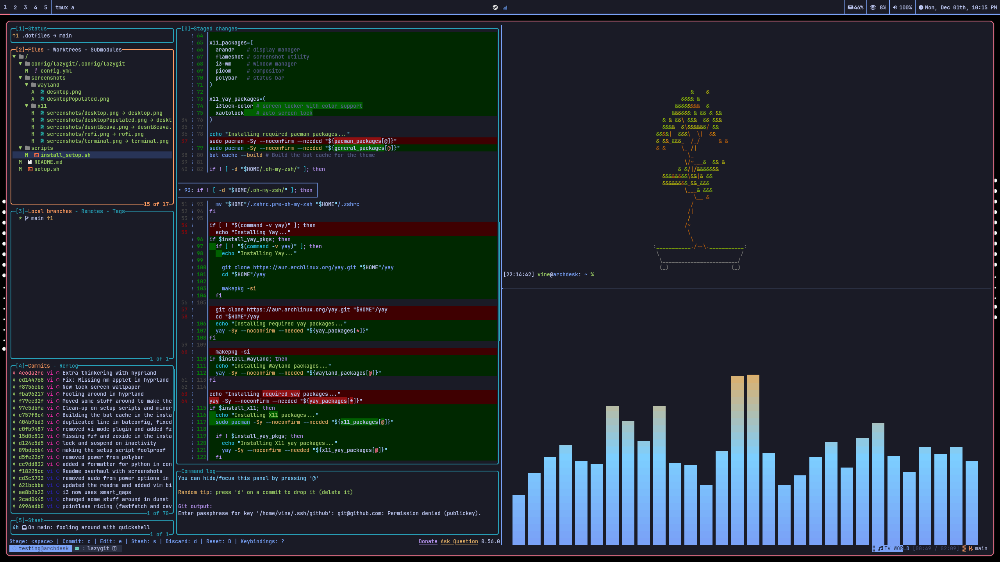
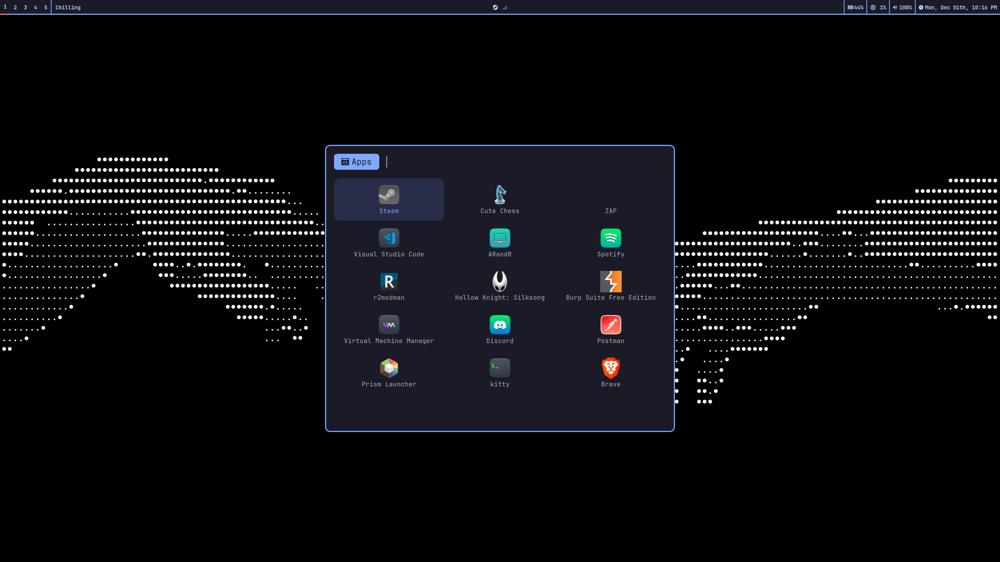

# .dotfiles

My personal dotfiles for my Arch Linux setup.

You'll quickly notice I gravitate toward a minimal desktop using the [Tokyo Night](https://github.com/folke/tokyonight.nvim) colorscheme. If that's your vibe too, you might enjoy this setup!

This repository includes both X11 and Wayland setups. The setup script can install either one individually, both, or neither.

## Packages

Most packages are shared between setups, but some are protocol-specific. Here are the key packages used in this setup (doesn't include all packages, see install script for complete list):

### Core Applications (Both Setups)

- dunst `(notification daemon)`
- kitty `(terminal emulator)`
- ly `(display manager)`
- neovim `(text editor)`
- rofi `(application launcher)`
- thunar `(file manager)`
- tmux `(terminal multiplexer)`
- tokyonight-gtk-theme-git `(tokyo Night GTK theme (AUR))`
- ttf-jetbrains-mono-nerd `(nerd font (AUR))`
- zsh + [Oh My Zsh](https://ohmyz.sh/) `(shell and framework)`

### X11 Specific

- arandr `(display configuration GUI)`
- feh `(wallpaper setter)`
- flameshot `(screenshot utility)`
- i3-wm `(window manager)`
- i3lock-color `(screen locker (AUR))`
- picom `(X compositor)`
- polybar `(status bar)`
- xautolock `(idle management (AUR))`

### Wayland Specific

- grim `(screenshot utility)`
- hypridle `(idle management)`
- hyprland `(compositor/window manager)`
- hyprlock `(screen locker)`
- hyprpaper `(wallpaper setter)`
- waybar `(status bar)`

> Complete package lists are available in `/scripts/install_setup.sh` within the `*_packages` variables.

## Screenshots

<details>
  <summary><h3>X11 Setup (Click to Expand)</h3></summary>








</details>

<details>
  <summary><h3>Wayland Setup (Click to Expand)</h3></summary>









</details>

## Installation

The script below fetches `setup.sh`, which configures the environment using helper scripts in `/scripts`.

**Requirements**: `curl`, `bash`, `git` and `stow` need to be installed. If they aren't, `setup.sh` will ask for confirmation and install them if allowed.

> ⚠️ **Warning**: This script is designed for fresh Arch Linux installations. If you're on an existing setup, **back up your configurations** before running it. While there are some guardrails in place, caution is always wise!

### Quick Install (Both X11 & Wayland)

```bash
bash -c "$(curl -fsSL https://raw.githubusercontent.com/2viny/.dotfiles/main/setup.sh)" -- -xwy
```

### Custom Installation

You can also install specific components:

```bash
# X11 only
bash -c "$(curl -fsSL https://raw.githubusercontent.com/2viny/.dotfiles/main/setup.sh)" -- -xy

# Wayland only
bash -c "$(curl -fsSL https://raw.githubusercontent.com/2viny/.dotfiles/main/setup.sh)" -- -wy

# Base packages only (no desktop environment)
bash -c "$(curl -fsSL https://raw.githubusercontent.com/2viny/.dotfiles/main/setup.sh)" -- -y
```

### Setup Flags

- `-x` - Install X11 setup (i3-wm, polybar, picom, etc.)
- `-w` - Install Wayland setup (Hyprland, waybar, etc.)
- `-y` - Install yay, if needed, and AUR packages (themes, fonts, additional tools)

> **Note**: This setup is optimized for my hardware configuration. You may need to adjust display settings, keybindings, or other hardware-specific configurations for your system. Feel free to reach out if you need help

### Post-Installation

After running the setup script, complete these steps to finalize your installation:

1. **Enable Display Manager**:

   ```bash
   # Enable ly display manager
   sudo systemctl enable ly

   # If changing from an existing setup, disable old display manager
   # Common examples:
   sudo systemctl disable gdm      # GNOME
   sudo systemctl disable sddm     # KDE
   sudo systemctl disable lightdm  # XFCE
   sudo systemctl disable $old_dm  # Other
   ```

1. **Install hardware dependent software** (as needed):

   ```bash
   # this is a example, look up how
   # to set up based on your hardware
   sudo pacman -S mesa # AMD drivers
   ```

1. **Configure System Services** (as needed):

   ```bash
   # Network management
   sudo systemctl enable --now NetworkManager

   # Bluetooth support
   sudo systemctl enable --now bluetooth

   # PulseAudio/Pipewire
   systemctl --user enable --now pulseaudio
   systemctl --user enable --now pipewire pipewire-pulse

   # Others
   sudo systemctl enable --now $systemd_managed_service
   ```

1. **Reboot** to ensure all changes take effect

> **Note**: This setup intentionally avoids enabling system services automatically to prevent conflicts on existing installations. Enable services based on your specific hardware and requirements.
